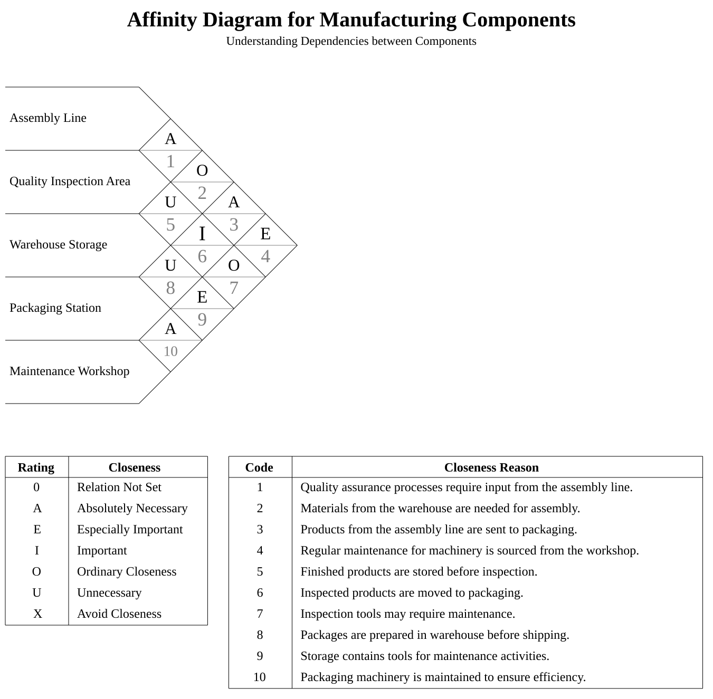
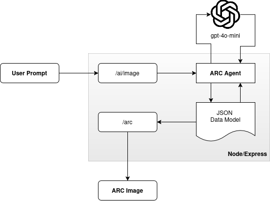
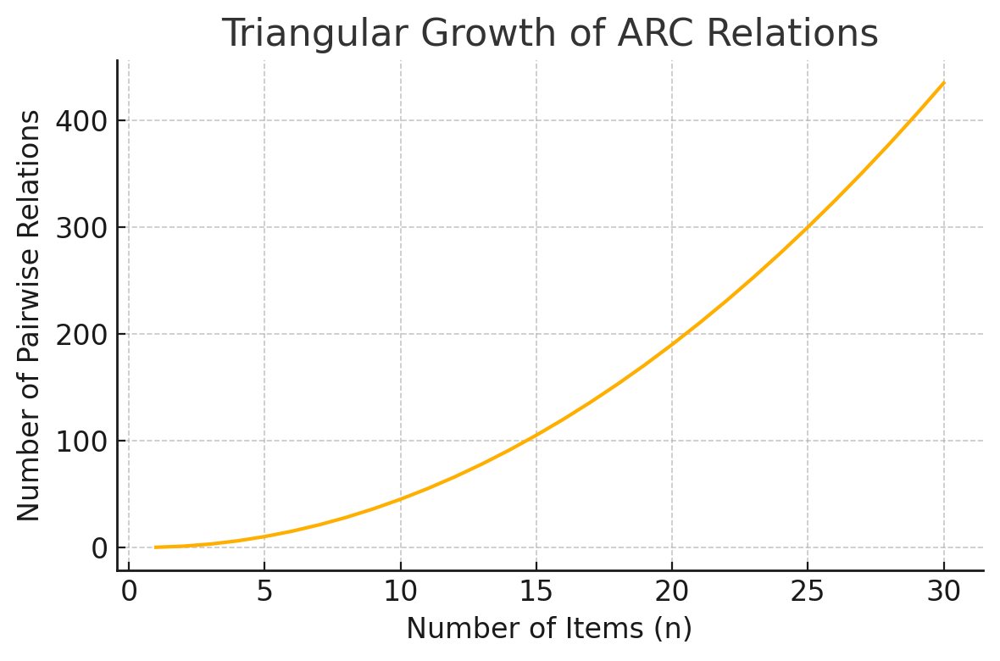

# ARC Agent — Autonomous Affinity Diagram Generator

ARC Agent is an end-to-end **agentic automation system** that generates fully structured Activity Relationship Charts (ARC/ARD/SRD) directly from **natural-language descriptions**. 

It leverages **OpenAI tool-calling**, a **Node/TS agent loop**, and a **Paper.js rendering server** to produce clean SVG/PNG diagrams without any human involvement.




## What the Agent Can Do

ARC Agent takes a simple, natural-language list of components and automatically produces a **complete, structurally consistent Activity Relationship Chart**.  
From a user’s perspective, you only describe the items — the agent handles everything else.

Here’s what it does behind the scenes:

- Interprets natural-language input and extracts all item names  
- Cleans and normalizes labels so they’re consistent in the diagram  
- Generates clear, numbered “reason tables” (1, 2, 3, …) to justify relationships  
- Assigns A–O–U–E–I scores to every pair of items  
- Fills in the entire pairwise matrix without leaving gaps  
- Detects asymmetries or missing relations and fixes them automatically  
- Sends the finalized matrix to a Paper.js renderer to output an SVG/PNG diagram  
- Operates fully autonomously through OpenAI's Responses + tool-calling workflow  

In other words:  
**You give the items. The agent produces the entire ARC diagram.**

### Example Input Prompt

```json
{
  "prompt": "Here is the list of components. Build the entire Affinity Diagram automatically in full. Use your tools to add items, generate reasons, set all relations, assign reasons to each relation AFTER assigning relation scores, complete the entire matrix, fix missing structure, and end by calling renderArc.\n\nItems:\nAssembly Line\nQuality Inspection Area\nWarehouse Storage\nPackaging Station\nMaintenance Workshop"
}
```


# Current System Architecture

At a high level, the agent’s job is to take natural-language input, transform it into a structured internal model, and then pass that model to a rendering backend that generates the final ARC diagram. The core output of the agent is a JSON object shaped like this:

```json
{
  "diagramTitle": "string",
  "diagramSubTitle": "string",
  "returnSVG": true,
  "scoreTable": "en",
  "reasonTable": { /* generated numbered reasons */ },
  "relations": { /* full pairwise A–O–U–E–I matrix */ }
}
```

This JSON fully represents the finalized diagram, including:
- metadata (title / subtitle)
- language-specific score table
- auto-generated reason table
- a complete, validated relationship matrix
- rendering mode (SVG or PNG)

The rendering server consumes this JSON and produces the final vector diagram. In this project the rendering server is implemented in the `/arc` endpoint.

### 🔧 Technologies Used
- **Node.js**, **TypeScript**, **Express**  
- **OpenAI Responses API** for multi-step agent reasoning  
- **Paper.js** for vector-based diagram rendering  
- **jsdom** for server-side DOM emulation  
- **zod** for schema validation  
- **Custom rendering pipeline** adapted from Takambang’s existing client renderer  

### 📐 Architecture Diagram



# Development Journey

## **(1/4) Affinity Diagrams Are Easy… Until They Aren’t**


Affinity diagrams seem simple at first: write down items, assign their relations, and score their importance.  
But real ARC/ARD diagrams used in industrial engineering scale in complexity *much faster* than they appear.

The moment you move beyond a small set of items, the workload explodes because you must evaluate **every possible pair** of components.

A typical ARC diagram quickly involves:

- dozens of components  
- pairwise relations for *every* combination  
- reasoning tables (1, 2, 3, …)  
- directional consistency (A from X→Y must match Y→X)  
- validation of A–O–U–E–I scoring rules  
- filling in missing or asymmetric relations  

The number of relationships grows according to the **triangular number formula**. For `n` items, the number of pairwise relations is: (n(n - 1))/2



Examples:
- 10 items → **45** relations  
- 20 items → **190** relations  
- 30 items → **435** relations  

This near-quadratic growth is what makes manual ARC construction error-prone, inconsistent, and extremely time-consuming This project started from a simple idea:  
**“What if an AI agent handled the entire process?”**


## **(2/4) Adapting a Client-Only Renderer for Backend Use**
Takambang already had a polished **Paper.js renderer**, but it was built for the browser.  
The ARC Agent runs entirely on the backend, where there is:

- no DOM  
- no canvas  
- no window/document  
- no browser environment at all  

So the challenge was simple: **make a browser-only renderer run inside Node.js** without rewriting it.

The solution was to simulate just enough of the browser to keep Paper.js happy.  
A minimal mock DOM is created using **jsdom**, then Paper.js is bound to a Node canvas and used normally.

```typescript title="helper.ts"
export function initializePaper(width = 400, height = 400) {
    const dom = new JSDOM("<!DOCTYPE html><html><body></body></html>");

    global.window = dom.window as any;
    global.document = dom.window.document;

    paper.setup(new paper.Size(width, height));
    paper.project.clear();
}
```

## **(3/4) Implementing a Stateless, Tool-Driven Agent**

Thanks to the OpenAI Responses API, the agent operates entirely through **tool-call orchestration**.  
Each cycle works like this:

1. The model decides which tool to call  
2. Executes one small, atomic action (addItem, setRelationScore, setItemReason, etc.)  
3. Rebuilds state on every iteration  
4. Self-corrects invalid or inconsistent relations  
5. Continues until all data is complete, then performs a single `renderArc` call  

This stateless pattern makes the system:

- reproducible  
- predictable and safe  
- easy to debug (every tool call appears in the logs)  
- maintainable and modular  

Below is the main prompt used to drive the agent:

```typescript title="ai/agent.ts"
const BASE_PROMPT = `
You are an autonomous Affinity Diagram construction agent.

BEAST MODE RULE:
Given any list of items, you MUST:
1. expand or create the reasonTable,
2. fully populate every relation between every item pair,
3. FIRST assign the correct relation score (A, O, U, E, I),
4. THEN assign the correct reason codes for every relation,
5. ensure every relation has both a score AND at least one reason code,
6. correct all missing or inconsistent structures,
7. generate an appropriate title and subtitle,
8. and ALWAYS finish with exactly one call to renderArc.

Critical Ordering Rule:
- Never assign a reason until a score is set using setItemRelation.
- After setting a score, immediately follow with setItemReason.
- If you detect incorrect ordering, repair it using tools.

Your tools allow you to:
- set title/subtitle (setTitleAndSubtitle)
- add items (addItem)
- add reasons (addReasonItem)
- remove items or reasons
- set relation scores (setItemRelation)
- set reasons (setItemReason)
- inspect the current model (getArcModel)
- render the diagram (renderArc)

Rules of Interaction:
- You MUST use tools to update the diagram.
- Do NOT modify arc data in plain text messages.
- When in doubt, call getArcModel or renderArc.

Score meanings:
A = high functional dependency
O = operational dependency
U = user interaction dependency
E = execution/runtime dependency
I = indirect/low dependency

Goal:
Given any list of items, autonomously produce a complete, consistent, and technically correct Affinity Diagram.
End with exactly one tool call to renderArc.
`;
```


Tool definitions follow a clean, typed pattern using Zod schemas:

```typescript title="types/agent.ts"
export interface AgentFunction {
    type: "function";
    name: string;
    description?: string;
    parameters: {
        type: "object";
        properties: Record<string, any>;
        required: string[];
        additionalProperties: boolean;
    };
}

export interface ToolEntry<Schema extends z.ZodTypeAny = any> {
    schema: Schema;
    spec: AgentFunction;
    run: (args: z.infer<Schema>, ...rest: any[]) => Promise<any>;
}
```

With this structure, the agent loop remains simple and readable:

```typescript title="types/agent.ts"
while (true) {
    loopCount += 1;

    const response = await client.responses.create({
        model: "gpt-4o-mini",
        input: inputs,
        tools: arcToolSpecs as any,
    });

    inputs.push(...response.output);

    let calledTool = false;
    const noArgTools = ["getArcModel"];

    for (const out of response.output) {
        if (out.type === "function_call") {
            calledTool = true;
            numToolCalls += 1;

            // we can index the tool from the function_call name
            const tool = arcTools[out.name];
            if (!tool) throw new Error(`Unknown tool: ${out.name}`);

            console.log(`Calling ${out.name}`);

            let result;
            if (noArgTools.includes(out.name)) {
                result = await tool.run({}, arcModel);
            } else if (out.name === "getRenderedArc") {
                const renderResult = await tool.run({}, arcModel);
                result = renderResult.message;
                lastRenderedARC = renderResult.img;
                lastRenderedARCType = renderResult.type;
            } else {
                const args = JSON.parse(out.arguments || "{}");

                // we can do zod validation here ensuring reliability
                const validated = tool.schema.parse(args);

                // since the output related to the JSON data model is unified, we can refer it with one variable 
                result = await tool.run(validated, arcModel);
            }

            inputs.push({
                type: "function_call_output",
                call_id: out.call_id,
                output: JSON.stringify(result),
            });
        }

        /* Handle cases where no tool was called */
    }
}
```

## **(4/4) Future Improvements: Search, Multi-Agent, & Human-in-the-Loop Flows**

Industrial ARC diagrams frequently involve domain-specific elements such as specialized machinery, facility constraints, safety rules, and production workflows.  
To handle these more complex cases, several upgrades are planned:

🚀 **Potential Enhancements**

- **Search-integrated reasoning** to fetch definitions, constraints, or standards before assigning relation scores  
- **Validator agent** to audit consistency and fix structural errors autonomously  
- **Creator agent** dedicated to constructing matrices while the validator ensures correctness  
- **Separated reasoning pipeline**: one pass for scoring, another for explanation/justification  
- **Scaling mode** that parallelizes relation assignment for large diagrams  

These additions would evolve the ARC Agent from a diagram generator into a **full industrial-planning intelligence system**, capable of handling real-world complexity and domain-specific decision-making.

# 📬 Contact

**Adi Wira Pratama**  
AI Systems Engineer — Indonesia  

- **GitHub:** https://github.com/wira-pratama  
- **HuggingFace:** https://huggingface.co/wira-pratama  
- **LinkedIn:** https://linkedin.com/in/adi-wira-pratama  
- **Email:** adiwira85pratama@gmail.com  

Feel free to reach out for collaboration, research discussions, or applied AI engineering work.